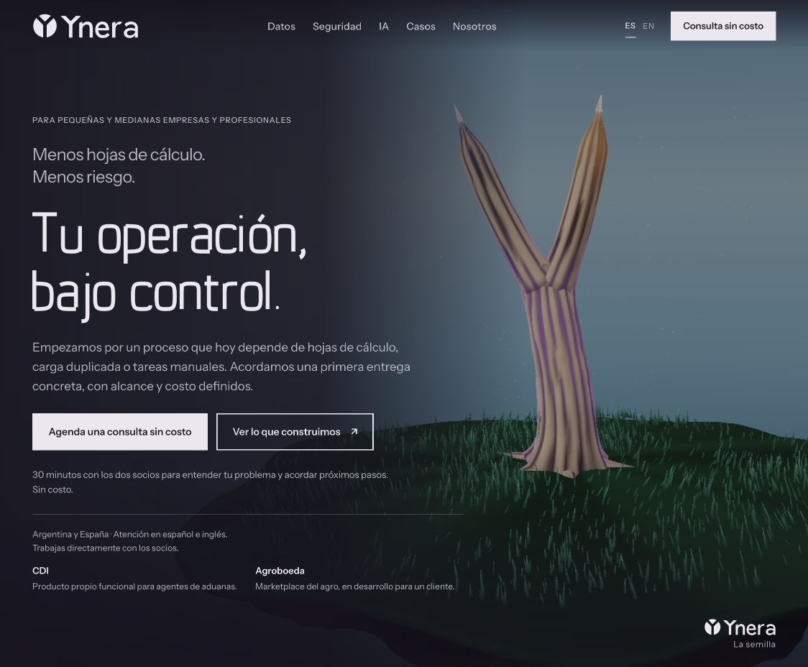
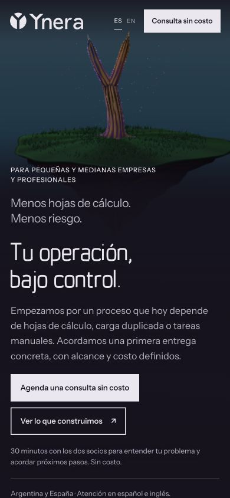
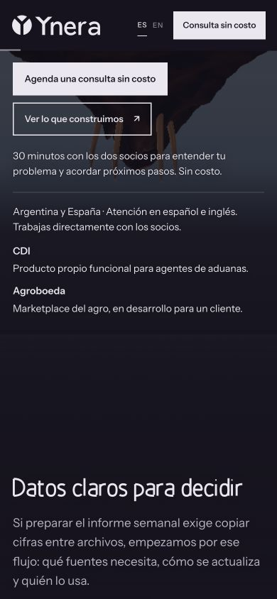

# Revisión independiente de logo y tipografía · 4 de octubre de 2026

Revisora: Astra, esfuerzo alto, sin historial de diseño. Versión evaluada: `609b282` de `main`. Encargo: crítica adversarial de identidad, lectura y confianza comercial, con alcance acotado. Informe sintetizado fielmente por la PM; no implica una prueba de conversión ni un estudio con usuarios.

## Veredicto

**Conservar la identidad actual.** La firma símbolo + Ynera completo se lee y el círculo con Y negativa aporta una forma compacta potencialmente recordable. Los titulares tienen carácter propio y suficiente control; las capturas no muestran un defecto que justifique redibujar el logo o sustituir la fuente.

La memorabilidad es prometedora, pero no está demostrada. Una inspección visual no confirma recuerdo posterior ni diferenciación frente al mercado. No se realizó búsqueda de marcas semejantes.

## Logo y tipografía

El nombre completo permite comprender la marca sin que el símbolo deba explicarse solo. En escritorio y móvil actual, la separación entre símbolo y palabra funciona; Ynera se lee sin esfuerzo.

Ynera Sistema se ve deliberada, no amateur: estrechez, curvas contenidas y formas algo rectangulares aportan una voz técnica. «Tu operación, bajo control» mantiene lectura clara en móvil, sin recortes ni colisiones visibles. Instrument Sans sostiene párrafos y botones.

El lettering abierto del logo, los titulares estrechos y el cuerpo convencional establecen jerarquía. No hay necesidad de unificarlos. La presentación tiene identidad propia y no se observa un defecto tipográfico que por sí solo deteriore la confianza comercial. La solvencia debe demostrarse también mediante casos y compromisos.

## Único hallazgo observable

**P3 · lectura secundaria.** La aclaración «30 minutos con los dos socios…» aparece sensiblemente más pequeña y tenue que el párrafo y los botones, especialmente en móvil. En escritorio ocurre algo parecido con la información territorial y las descripciones de proyectos. Se lee, pero exige más atención donde se explican condiciones y evidencia comercial.

No se midió contraste; esto no afirma incumplimiento.

## Mejora propuesta y aceptación

Probar esos textos comerciales secundarios a **14 px en móvil** y comprobar contraste sobre el fondo efectivo. Aceptar solo si mejora perceptiblemente la lectura sin ampliar, sin desbordamientos entre 320 y 390 px y sin una altura añadida desproporcionada. Conservar el tamaño actual si no hay mejora suficiente.

Criterio para texto normal: contraste mínimo 4,5:1, conforme a [WCAG 2.2, contraste mínimo](https://www.w3.org/WAI/WCAG22/Understanding/contrast-minimum.html). Este es un criterio para una verificación futura, no un resultado medido de la página.

## Qué conservar y qué descartar

Conservar composición símbolo + nombre completo, Y negativa, Ynera Sistema para titulares, Instrument Sans para lectura/acciones y salto del hero en dos líneas. El móvil actual ya resuelve los cortes de palabras de la captura anterior.

Redondear más la fuente, ensanchar el titular o eliminar la segunda Y son preferencias estilísticas, sin una corrección respaldada por estas imágenes. No se recomiendan.

## Decisión de PM y continuidad

Se adopta el criterio de **no rediseñar por defecto**. La mejora se propuso primero sin modificar la web. Emi pidió luego aplicarla; su implementación y validación se detallan al final. No se rediseñaron el logo ni los titulares.

Límites: capturas de escritorio y móvil de 390 px, lectura de SVG/CSS. No se validaron recuerdo con usuarios, símbolo aislado a 16 px, todo el repertorio de la fuente ni la firma violeta sobre papel. Las pruebas de móvil en viewport no sustituyen un teléfono real.

## Evidencia guardada

## Mejora aplicada por pedido de Emi

Texto de condiciones de consulta, presencia territorial y resúmenes de CDI/Agroboeda a 14 px, interlínea 1,55 y tinta #EAE8EE en escritorio y móvil. Se mantienen fuentes y jerarquía.

En móvil se retiró el desvanecimiento del contenedor del hero: antes atenuaba también los proyectos cuando el lector bajaba hasta ellos. El texto permanece opaco y no se desplaza artificialmente. Se conserva la animación del árbol.

En escritorio la escena nocturna usa ahora el mismo plano oscuro de lectura que día/atardecer; el fondo móvil conserva su gradiente. Sin cambios en geometría, materiales, resolución o animación del árbol.

Validación visual de ES/EN a 390/320 px y escritorio: texto legible durante el desplazamiento y sin desborde horizontal. Verificación existente de contenido, FAQ y enlaces aprobada; diff limpio.

Muestreo de fondo efectivo junto a las líneas de texto, usando el color declarado #EAE8EE: mínimos de 11,67:1 en día, 11,79:1 en atardecer, 8,28:1 en noche (escritorio) y 7,92:1 en móvil de 390 px durante el desplazamiento. Cada captura aporta unas 1.900 muestras de fondo; detalles en `evidencia-2026-10-04/contraste-aplicacion.json`. No se usaron píxeles de las letras suavizadas para calcular luminancia. Este muestreo de capturas no certifica toda la web ni todos los fotogramas de la escena.

